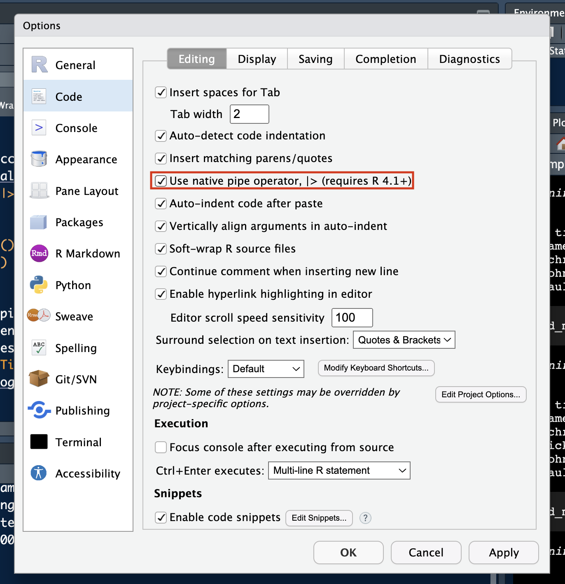
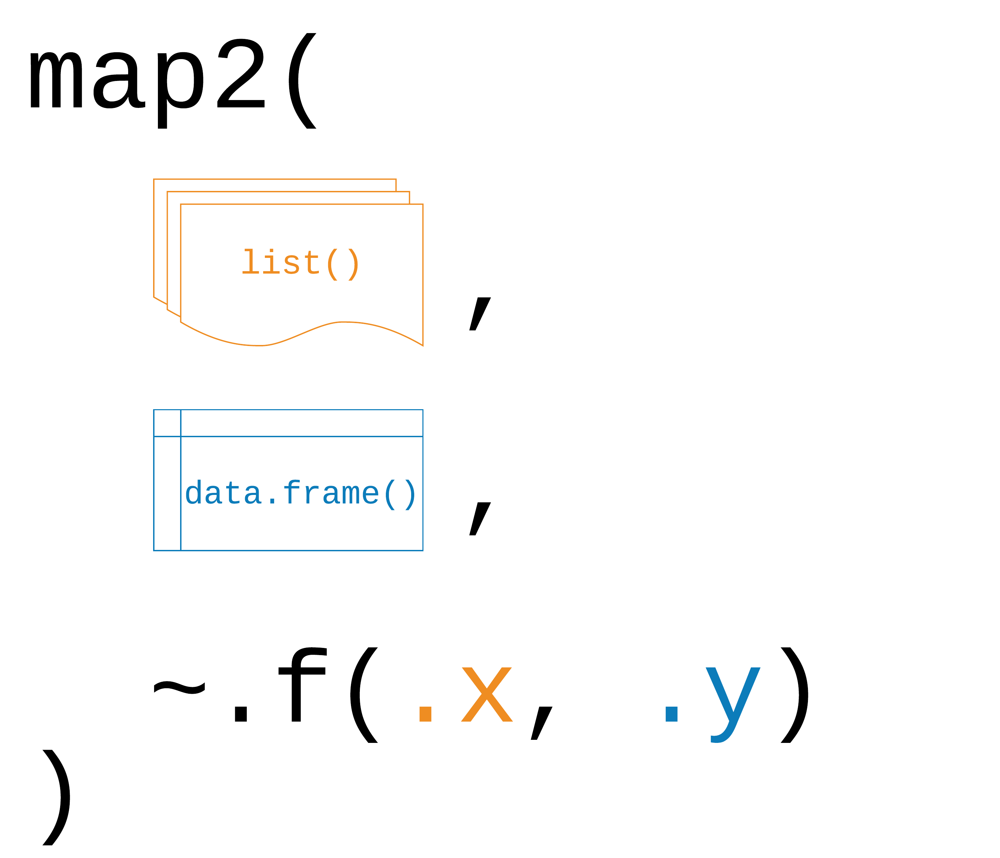

```{=html}
<style>
.h1,h2,h3 {
color:#2f1a61;
}

.subtitle, section.normal {
color:#291854;
}

.title {
color:#cc0065;
}

.nav-pills>li>a{
color: #2f1a61;
}

.nav-pills>li.active>a, .nav-pills>li.active>a:hover, .nav-pills>li.active>a:focus {
color: #fff;
background-color: #2f1a61;
}

.nav-tabs>li>a{
color: #2f1a61;
}

.nav-tabs>li.active>a, .nav-tabs>li.active>a:hover, .nav-tabs>li.active>a:focus {
color: #fff;
background-color: #2f1a61;
}

</style>
```
```{r setup, include=FALSE}
knitr::opts_chunk$set(echo = TRUE, message = FALSE, warning = FALSE)
```

Today, we'll finally leave base R behind and make our lives much easier by introducing you to the tidyverse. `r emo::ji("sparkles")` We think for data cleaning, wrangling, and plotting, the tidyverse really is a no-brainer. A few good reasons for teaching the tidyverse are:

-   Outstanding documentation and community support
-   Consistent philosophy and syntax
-   Convenient "front-end" for more advanced methods

Read more on this [here](http://varianceexplained.org/r/teach-tidyverse/) if you like.

**But**... this certainly shouldn't put you off learning base R alternatives.

-   Base R is extremely flexible and powerful (and stable).
-   There are some things that you'll have to venture outside of the tidyverse for.
-   A combination of tidyverse and base R is often the best solution to a problem.
-   Excellent base R data manipulation tutorial [here](https://github.com/matloff/fasteR).

We will also learn about functional programming in R. We will teach you one of the most important parts of coding with R (and I cannot stress enough how important it is). Built-in functions and packages can only get you so far, there will be times when it is both easier and more efficient to create your own. Writing your own functions is a key skill in any coding language really, and R is no different. Unfortunately, writing your own function also requires you to be able to find and fix bugs that will inevitably creep into your code. For all of these reasons, this lab will teach you how to:

-   write your own functions
-   iterate functions over multiple inputs
-   vectorise your functions using the purrr package
-   debug your code

------------------------------------------------------------------------

# 1. The Tidyverse `r emo::ji("telescope")`

In general, the `tidyverse` is a collection of R packages that share an underlying design, syntax, and structure. One very prominent tidyverse package is `dplyr` for data manipulation.

In this lab, you will learn to:

-   understand what we mean by `tidy data`
-   identify the purpose of a set of `dplyr` functions

------------------------------------------------------------------------

## Tidyverse packages

Why is it called the tidy*verse*? Let's load the tidyverse meta-package and check the output.

```{r, message=TRUE}
library(tidyverse)
```

We see that we have actually loaded a number of packages (which could also be loaded individually): **ggplot2**, **tibble**, **dplyr**, etc. We can also see information about the package versions and some [namespace conflicts](https://raw.githack.com/uo-ec607/lectures/master/04-rlang/04-rlang.html#59).

The tidyverse actually comes with a lot more packages than those that are just loaded automatically.

```{r}
tidyverse_packages()
```

We'll use several of these additional packages during the remainder of this course.

Underlying these packages are two key ideas:

------------------------------------------------------------------------

## The pipe `%>%` operator

You might have seen the pipe operator in the past.

### The beauty of pipes {.tabset}

-   The forward-pipe operator `%>%` pipes the left-hand side values forward into expressions on the right-hand side.
-   It serves the natural way of reading ("do this, then this, then this, ...").
-   We replace `f(x)` with `x %>% f()`.
-   It avoids nested function calls.
-   It minimizes the need for local variables and function definitions.

#### The classic way

```{r, eval = FALSE}
hertie(
  bvg(
    walk(
      breakfast(
        shower(
          wake_up(
            Alex, 7
          ),
          temp = 38
        ),
        c("coffee", "croissant")
      ),
      step_function()
    ),
    train = "U2",
    destination = "Stadtmitte"
  ),
  course = "Intro to DS"
)
```

#### The classic way, nightmare edition

```{r, eval = FALSE}
alex_awake <- wake_up(Alex, 7)
alex_showered <- shower(alex_awake, 
                        temp = 38)
alex_replete <- breakfast(alex_showered, 
                          c("coffee", "croissant"))
alex_underway <- walk(alex_replete, 
                      step_function())
alex_on_train <- bvg(alex_underway, 
                     train = "U2", 
                     destination = "Stadtmitte")
alex_hertie <- hertie(alex_on_train, 
                      course = "Intro to DS")
```

#### The pipe way

```{r, eval = FALSE}
Alex %>%
  wake_up(7) %>%
  shower(temp = 38) %>%
  breakfast(c("coffee", "croissant")) %>%
  walk(step_function()) %>%
  bvg(
    train = "U2",
    destination = "Stadtmitte"
  ) %>%
  hertie(course = "Intro to DS")
```

### Piping etiquette

-   Pipes are not very handy when you need to manipulate **more than one object** at a time. Reserve pipes for a sequence of steps applied to one primary object.
-   Don't use the pipe when there are **meaningful intermediate objects** that can be given informative names (and that are used later on).
-   `%>%` should always have a space before it, and should usually be followed by a new line.

### The base R pipe: `|>`

The `magrittr` pipe has proven so successful and popular that the R core team [recently added](https://stat.ethz.ch/R-manual/R-devel/library/base/html/pipeOp.html) a "native" pipe operator to base R (version 4.1), denoted `|>`. Here's how it works:

``` r
mtcars |> subset(cyl == 4) |> head()
mtcars |> subset(cyl == 4) |> (\(x) lm(mpg ~ disp, data = x))()
```

Now, should we use the `magrittr` pipe or the native pipe? The native pipe might make more sense in the long term, since it avoids dependencies and might be more efficient. Check out [this Stackoverflow post](https://stackoverflow.com/questions/67633022/what-are-the-differences-between-rs-new-native-pipe-and-the-magrittr-pipe) and [this Tidyverse blog post](https://www.tidyverse.org/blog/2023/04/base-vs-magrittr-pipe/) for a discussion of differences.

You can update your settings, if you'd like RStudio to default to the native pipe operator `|>`.

```{r, echo=FALSE, fig.align='center', out.width="70%"}

```

------------------------------------------------------------------------

## Tidy Data `r emo::ji("card_index_dividers")`

Generally, we will encounter data in a tidy format. Tidy data refers to a way of mapping the structure of a data set. In a tidy data set:

1.  Each variable forms a column.
2.  Each observation forms a row.
3.  Each type of observational unit forms a table

```{r, fig.align='center', echo=F, out.width = "70%"}
knitr::include_graphics("pics/tidy_data.png")
```

------------------------------------------------------------------------

# 2. Data manipulation with `dplyr`

A second fundamental package of the tidyverse is called `dplyr`. In this section you'll learn and practice examples using some functions in `dplyr` to work with data. Those are:

-   `dplyr::select()`: Select (i.e. subset) columns by their names (keep or exclude some columns)
-   `dplyr::filter()`: Filter (i.e. subset) rows based on their values (keep rows that satisfy your conditions)
-   `dplyr::mutate()`: Create new columns or edit existing ones
-   `dplyr::group_by()`: Define groups within your data set
-   `dplyr::summarize()`: Collapse multiple rows into a single summary value (summary statistics)
-   `dplyr::arrange()`: Arrange (i.e. reorder) rows based on their values (reorder rows according to single or multiple variables)

```{r, echo=FALSE}
library(palmerpenguins)
```

To demonstrate and practice how these verbs (functions) work, we'll use the penguins dataset.

The 3 species of penguins in this data set are Adelie, Chinstrap and Gentoo. The data set contains 8 variables:

-   **species:** a factor denoting the penguin species (Adelie, Chinstrap, or Gentoo)
-   **island:** a factor denoting the island (in Palmer Archipelago, Antarctica) where observed
-   **culmen_length_mm:** a number denoting length of the dorsal ridge of penguin bill (millimeters)
-   **culmen_depth_mm:** a number denoting the depth of the penguin bill (millimeters)
-   **flipper_length_mm:** an integer denoting penguin flipper length (millimeters)
-   **body_mass_g:** an integer denoting penguin body mass (grams)
-   **sex:** a factor denoting penguin sex (MALE, FEMALE)
-   **year** an integer denoting the year of the record

------------------------------------------------------------------------

## `dplyr::select()`

The first verb (function) we will utilize is `dplyr::select()`. We can employ it to manipulate our data based on **columns**. If you recall from our initial exploration of the data set there were eight variables attached to every observation. Do you recall them? If you do not, there is no problem. You can utilize `names()` to retrieve the names of the variables in a data frame.

```{r}
names(penguins)
```

Say we are only interested in the species, island, and year variables of these data, we can utilize the following syntax:

`dplyr::select(data, columns)`


:::alert-info
**Exercise 1**

The following code chunk would select the variables we need. Can you adapt it, so that we keep the body_mass_g and sex variables as well?
:::

```{r,, eval=F}
dplyr::select(penguins, species, island, year)
```

Good to know: To **drop** variables, use `-` before the variable name, i.e. select(penguins, -year) to drop the year column (select everything but the year column).

------------------------------------------------------------------------

## `dplyr::filter()` `r emo::ji("coffee")`

The second verb (function) we will employ is `dplyr::filter()`. `dplyr::filter()` lets you use a logical test to extract specific **rows** from a data frame. To use `dplyr::filter()`, pass it the data frame followed by one or more logical tests. `dplyr::filter()` will return every row that passes each logical test.

The more commonly used logical operators are:

-   `==`: Equal to
-   `!=`: Not equal to
-   `>`, `>=`: Greater than, greater than or equal to
-   `<`, `<=`: Less than, less than or equal to
-   `&`, `|`: And, or

Say we are interested in retrieving the observations from the year 2007. We would do:

```{r , eval=F}
dplyr::filter(penguins, year == 2007)

# same as writing
# penguins %>% dplyr::filter(year == 2007)
```


:::alert-info
**Exercise 2**

We can leverage the pipe operator to sequence our code in a logical manner. Can you adapt the following code chunk with the pipe and conditional logical operators we discussed?
:::

```{r}
only_2009 <- dplyr::filter(penguins, year == 2009)
only_2009_chinstraps <- dplyr::filter(only_2009, species == "Chinstrap")
only_2009_chinstraps_species_sex_year <- dplyr::select(only_2009_chinstraps, species, sex, year)
final_df <- only_2009_chinstraps_species_sex_year
final_df #to print it in our console

```

------------------------------------------------------------------------

## `dplyr::mutate()` ``` r emo::ji("closed_umbrella")``r emo::ji("open_umbrella") ```

`dplyr::mutate()` lets us create, modify, and delete columns. The most common use for now will be to create new variables based on existing ones. Say we are working with a U.S. American client and they feel more comfortable with assessing the weight of the penguins in pounds. We would utilize `mutate()` as such:

```         
dplyr::mutate(new_var_name = manipulated old_var(s))
```

```{r,, eval=F}
penguins |>
  dplyr::mutate(body_mass_lbs = body_mass_g/453.6)
```

------------------------------------------------------------------------

## `dplyr::group_by()` and `dplyr::summarize()`

These two verbs `dplyr::group_by()` and `dplyr::summarize()` tend to go together. When combined , `dplyr::summarize()` will create a new data frame. It will have one (or more) rows for each combination of grouping variables; if there are no grouping variables, the output will have a single row summarizing all observations in the input. For example:

```{r}
# compare this output with the one below
penguins |>
  dplyr::summarize(heaviest_penguin = max(body_mass_g, na.rm = T)) 
```

```{r}
penguins |>
  dplyr::group_by(species) |>
  dplyr::summarize(heaviest_penguin = max(body_mass_g, na.rm = T)) |>
  dplyr::ungroup()
```

There is also an alternate approach to calculating grouped summary statistics called per-operation grouping. This allows you to define groups in a `.by` argument, passing them directly in the `summarize()` call. These groups don't persist in the output whereas the ones used with `group_by` do. You can read more about both these approaches in [R for Data Science, 2nd edition](https://r4ds.hadley.nz).

```{r}
penguins |>
  dplyr::summarise(heaviest_penguin = max(body_mass_g, na.rm = T), .by = species) |>
  dplyr::ungroup()

penguins |>
  dplyr::summarise(heaviest_penguin = max(body_mass_g, na.rm = T), .by = c(species, sex)) |>
  dplyr::ungroup()
```

> Notice that we are using `dplyr::ungroup()` after performing grouped calculations. It is a convention we encourage. If you forget to `ungroup()` data, future data management can produce errors in downstream operations. Just to be sage, use `dplyr::ungroup()` when you've finished with your calculations.


:::alert-info
**Exercise 3**
        
Can you get the weight of the lightest penguin of each species? You can use `min()`. What happens when in addition to species you also group by year `group_by(species, year)`?
:::

------------------------------------------------------------------------

## `dplyr::arrange()` ``` r emo::ji("egg")``r emo::ji("hatching_chick")``r emo::ji("hatched_chick") ```

The `dplyr::arrange()` verb is pretty self-explanatory. `dplyr::arrange()` orders the rows of a data frame by the values of selected columns in ascending order. You can use the `desc()` argument inside to arrange in descending order. The following chunk arranges the data frame based on the length of the penguins' bill. You hint tab contains the code for the descending order alternative.

```{r, eval=F}
penguins |>
  dplyr::arrange(bill_length_mm)

```

```{r, eval=F}
penguins |>
  dplyr::arrange(desc(bill_length_mm))

```


:::alert-info
**Exercise 4**

Can you create a data frame arranged by body_mass_g of the penguins observed in the "Dream" island?
:::

------------------------------------------------------------------------

## Optional: Other `dplyr` functions

`dplyr::slice()`: Subset rows by position rather than filtering by values.

```{r eval=F}
penguins |> dplyr::slice(c(1, 5))
```

------------------------------------------------------------------------

`dplyr::pull()`: Extract a column from a data frame as a vector or scalar.

```{r eval=F}
penguins |> 
  dplyr::filter(sex == "female") |> 
  dplyr::pull(flipper_length_mm)
```

------------------------------------------------------------------------

`dplyr::count()` and `dplyr::distinct()`: Number and isolate unique observations.

```{r eval=F}
penguins |> dplyr::count(species)
penguins |> dplyr::distinct(species)
```

*Note:* You could also use a combination of `dplyr::mutate`, `dplyr::group_by`, and `n()`, e.g. `penguins |> dplyr::group_by(species) |> dplyr::summarize(num = n())`.

------------------------------------------------------------------------

`dplyr::where()`: Select the variables for which a function returns true.

```{r eval=F}
penguins |> dplyr::select(dplyr::where(is.numeric)) |> names()
```

------------------------------------------------------------------------

`dplyr::across()`: Summarize or mutate multiple variables in the same way. More information [here](https://dplyr.tidyverse.org/reference/across.html).

```{r eval=F}
penguins |> dplyr::mutate(dplyr::across(dplyr::where(is.numeric), scale)) |> head(3)
```

------------------------------------------------------------------------

`dplyr::case_when()`: Vectorize multiple `if_else()` (or base R `ifelse()`) statements.

```{r eval=F}
#multiple conditional statements
penguins |> 
  dplyr::mutate( 
    flipper_length_cat = 
      dplyr::case_when(
        flipper_length_mm < 190 ~ "small",
        flipper_length_mm >= 190 & flipper_length_mm < 210 ~ "medium",
        flipper_length_mm >= 210  ~ "large"
      )
  ) |>
  dplyr::pull(flipper_length_cat) |> table()
```

**Window functions**: There are also a whole class of [window functions](https://cran.r-project.org/web/packages/dplyr/vignettes/window-functions.html) for getting leads and lags, ranking, creating cumulative aggregates, etc. See `vignette("window-functions")`.

------------------------------------------------------------------------

# 3. Functions with `R`

------------------------------------------------------------------------

## Quick review: lists `r emo::ji("page_with_curl")`

One of the more important objects in R for functional programming are lists. Since we only briefly touched upon them in Week 1, let's go over them again in more detail.

Vectors can only hold a single data type.

```{r}
vec <- c(a = "hello", b = 1)
```

By comparison lists can hold many different data types at the same time.

```{r}
list <- list(a = "hello", b = 1, c = mean)
```

When you think about, data.frames are also lists (or rather a list of columns).

```{r}
library(gapminder)
head(gapminder) 
```

Checking:

```{r}
as.list(head(gapminder))
```

Lists will be very common (and useful) once you get into the writing of your functions and iterating them using the `purrr` family of functions.

------------------------------------------------------------------------

## Functions `r emo::ji("factory")`

In any coding language a fundamental principle should be **DRY** (**D**on't **R**epeat **Y**ourself). You should adhere to this as much as possible, but really, once you have copy-pasted code twice, it is time to write a function.

Functions allow you to automate tasks in a more powerful and general way than copy-and-pasting. Writing a function has three big advantages over using copy-and-paste:

1.  You can give a function an evocative name that makes your code easier to understand.

2.  As requirements change, you only need to update code in one place, instead of in many.

3.  You eliminate the chance of making incidental mistakes when you copy and paste (i.e. updating a variable name in one place, but not in another).

You can read more on functions in [this section](https://r4ds.had.co.nz/functions.html#functions) of Rfor Data Science.

------------------------------------------------------------------------

## Basic Syntax

What does code look like that calls for writing a function? Something along these lines:

```{r, results=FALSE}
df <- data.frame(
  a = rnorm(100, 5, 2),
  b = rnorm(100, 100, 15),
  c = rnorm(100, 2, 1),
  d = rnorm(100, 36, 7)
)

df$a <- (df$a - mean(df$a, na.rm = TRUE)) / sd(df$a, na.rm = TRUE)
df$b <- (df$b - mean(df$b, na.rm = TRUE)) / sd(df$a, na.rm = TRUE) # can you spot the mistake?
df$c <- (df$c - mean(df$c, na.rm = TRUE)) / sd(df$c, na.rm = TRUE)
df$d <- (df$d - mean(df$d, na.rm = TRUE)) / sd(df$d, na.rm = TRUE)
```

There are three key steps to creating a new function:

1.  Pick a **name** for the function. For us it could be `zscale` because this function re-scales (or "z-transforms") a vector to have a mean of 0 and a standard deviation of 1.

2.  You list the **inputs**, or **arguments**, to the function inside the brackets. Here we have just one argument. If we had more, the call would look like this: `function(x, y, z)`.

3.  You place the code you have developed in the **body** of the function. The body of the function is represented by a `{}` block that immediately follows the `function(...)` call.

The overall structure of a function looks like this:

```         
function_name <- function(input_parameters) {
  Do what you want to do in the body of the
  function, just like you would write other code in R.
}
```

In our example, we could simplify the z-transformation of four variables with this function:

```{r}
zscale <- function(x) {
  (x - mean(x, na.rm = T) / sd(x, na.rm = T))
}
```

> A word on **function names**. Generally, function names should be *verbs*, and arguments should be *nouns*. There are some exceptions: nouns are ok if the function computes a very well known noun (i.e. mean), or accessing some property of an object (i.e. coefficients). A good sign that a noun might be a better choice is if you're using a very broad verb like "get", "compute", "calculate", or "determine". Where possible, avoid overriding existing functions and variables. This might be a little tricky sometimes, as many good names are already taken by other packages. Nevertheless, avoiding the most common names from base R will avoid confusion.

------------------------------------------------------------------------

## Conditional functions `r emo::ji("shuffle_tracks_button")`

In practice you will often encounter a situation in which you would like to apply a function if a certain conditions are met. Luckily, including conditions in your custom functions is fairly straightforward. Here is what the syntax for such a conditional functions would look like.

``` r
if (this) {
  # do that
  } else if (that) {
  # do something else
  } else if (that) {
  # do something else
  } else {
  # do something else
}
```

The conditions in the normal brackets are specified using the logical operators of R (`!=`, `==`, `<`, `>`, etc.) or a function that returns a logical value. In many ways these conditions follow the same approach we applied to `dplyr::filter()` during last week's lab. The `{}` denominate the body of the function, just as with unconditional functions.

You could, for example, only transform numeric variables and code the function to warn you if you tried to scale a character variable.

```{r}
zscale <- function(x){
  if (is.numeric(x)) {
    (x - mean(x, na.rm = T) / sd(x, na.rm = T))
  } else {
    return("Not a numeric input!")
  }
}

zscale(df$a)
```

Now we can apply our function to any variable that we would like to transform. It will run even if we apply it to a character input, but warn us that the input does not fit the required input.

```{r, results = F}
df$a <- zscale(df$a)
df$b <- zscale(df$b)
df$c <- zscale(df$c)
df$d <- zscale(df$d)

# you can also use your function with a pipe!
df$d |> zscale()
```

Note that there is still a lot of repetition in the example above. We can get rid of this repetition using what coders call iteration `r emo::ji("point_down")`. We will take a look at it in a second.

------------------------------------------------------------------------

First, let's do one last exercise with functions. We will work with a fictional experimental study dataset "study.csv" that was generated for this course.

```{r, eval=T}
study <- readr::read_csv("https://raw.githubusercontent.com/intro-to-data-science-24/labs/main/session-03-tidyverse-functions/study.csv") 

glimpse(study)
```

------------------------------------------------------------------------

:::alert-info
**Exercise 5:**

Can you write a function to calculate the mode for a relevant variable in the data?

```{r}
# break down the problem into multiple parts
# you might want to 
# a) count how many times each value appears in a vector
# b) extract the value(s) that feature the most
```
:::

---

:::alert-info
**Exercise 6:**

What is the mode for the variable `bmi_3cat`?

```{r}

```
:::

------------------------------------------------------------------------

# 4. Iteration `r emo::ji("gear")`

Iteration helps you when you need to do the same thing to multiple inputs: repeating the same operation on different columns or on different datasets.

On the one hand, you have `for` loops and `while` loops, which are a great place to start because they make iteration very explicit. On the other hand, functional programming (FP) offers tools to extract out duplicated code, so each common `for` loop pattern gets its own function.

Remember the code above - it violates the rule of thumb that you should not copy-paste code more than twice.

```{r, results=FALSE}
# repetitive code
df$a <- zscale(df$a)
df$b <- zscale(df$b)
df$c <- zscale(df$c)
df$d <- zscale(df$d)
```

------------------------------------------------------------------------

## For-loops

To solve problems like this one with a `for` loop, we need to think again about the following three components:

1.  **Output:** we already have the output --- it's the same as the input because we are modifying data. If that is not the case, make sure to define a space where the output should go (e.g. an empty vector). If the length of your vector is unknown, you might be tempted to solve this problem by progressively growing the vector. However, this is not very efficient because in each iteration, R has to copy all the data from the previous iterations. In technical terms you get "quadratic" (O(n\^2)) behaviour which means that a loop with three times as many elements would take nine (3\^2) times as long to run. A better solution to save the results in a list, and then combine into a single vector after the loop is done. See more on this [here](https://r4ds.had.co.nz/iteration.html).

2.  **Sequence:** we can think about a data frame as a list of columns, so we can iterate over each column with `seq_along(df)`.

3.  **Body:** apply `zscale()` or any other function.

The better solution will look like this:

```{r, results = FALSE}
# repetitive code
df$a <- zscale(df$a)
df$b <- zscale(df$b)
df$c <- zscale(df$c)
df$d <- zscale(df$d)

# equivalent iteration
for (i in seq_along(df)) {       # seq_along() similar to length()
  df[[i]] <- zscale(df[[i]])     # [[]] because we are working on single elements
}
```

------------------------------------------------------------------------

Remember, this only works for `for` loops that manipulate existing inputs (ie. columns in a dataframe). If you want to save the output of your function in a different way, you need to define the object where you wish to store the output **ahead** of the function. In this case, you will see a pre-defined vector and an empty list:

```{r}
###### Vector

# creating an "empty" vector to put the values
output_median <- vector("double", ncol(df))

# running for loop
for (i in seq_along(df)) {            
  output_median[[i]] <- median(df[[i]])
}

# checking result
output_median

##### List 

# creating an "empty" vector to put the values
output_median_list <- list()

# running for loop
for (i in seq_along(df)) {            
  output_median_list[[i]] <- median(df[[i]])
}

# checking result
output_median_list

```

------------------------------------------------------------------------

## While-loops

You should also be aware that there is a conditional version of for-loops called while loops. Their uses are a little more niche and as such will not be covered in this lab. For those among you who are curious about them, you can find a pretty good tutorial [here](https://www.r-bloggers.com/2021/09/r-while-loop/).

------------------------------------------------------------------------

## The `purrr` package `r emo::ji("cat")`

For-loops are not as important in R as they are in other languages because R is a functional programming language. This means that it's possible to wrap up for-loops in a function, and call that function instead of using the for-loop directly. `r emo::ji("bulb")`

------------------------------------------------------------------------

### Basic syntax `r emo::ji("pen")`

The `purrr` package provides functions that eliminate the need for many common for loops. The apply family of functions in base R (`apply()`, `lapply()`, `tapply()`, etc.) solve a similar problem, but purrr is more consistent and thus is easier to learn. The most useful function will be `map(.x, .f)`, where:

-   `.x`: is a vector, list, or data frame
-   `.f`: is a function
-   output: is a list

```{r, echo = FALSE, out.width="49%", out.height="20%",fig.cap="Logic behind vectorised functions (also called functional programming).",fig.show='hold',fig.align='center'}
knitr::include_graphics("pics/purrr_f_list.png")
```

------------------------------------------------------------------------

Three ways to pass functions to `map()`:

1.  pass directly to `map()`

```{r, results=FALSE}

purrr::map(df, mean, na.rm = TRUE) 

```

2.  use an anonymous function `\(x)`

```{r, results=FALSE}

purrr::map(df, \(x) {
  mean(x, na.rm = TRUE) }
)

```

3.  use `~`

```{r, results=FALSE}

purrr::map(.x = df, ~ mean(.x, na.rm = TRUE))

```

------------------------------------------------------------------------

Let's look at this in practice. Imagine you want to calculate the mean of each column in your data frame:

```{r, results=FALSE}
# repetitive code
mean(df$a)
mean(df$b)
mean(df$c)
mean(df$d)


# equivalent map function
purrr::map(.x = df, ~ mean(.x, na.rm =T))

# map function in tidyverse style
df |> purrr::map(mean)

```

------------------------------------------------------------------------

## The `purrr::map*()` family of functions `r emo::ji("family")`

The pattern of looping over a vector, doing something to each element and saving the results is so common that the purrr package provides a family of functions to do it for you. Indeed, their use is so common that several wrapper functions were created to include the final transformation of the list output. There is one function for each type of output:

-   `purrr::map()` returns a list.
-   `purrr::map_lgl()` returns a logical vector
-   `purrr::map_int()` returns an integer vector.
-   `purrr::map_dbl()` returns a double vector.
-   `purrr::map_chr()` returns a character vector.

------------------------------------------------------------------------

:::alert-info
**Exercise 7:**

Go back to the example above, since all of the means are numeric, it makes more sense to store them in a vector rather than a list. Which function should we use?
:::

```{r}

```


------------------------------------------------------------------------

## `purrr::map2` `r emo::ji("double_exclamation_mark")`

You can also iterate over two inputs at the same time using `map2(.x, .y, .f)`

```{r, echo = FALSE, out.width="49%", out.height="20%",fig.cap="Logic behind map2().",fig.show='hold',fig.align='center'}


```

The function works exactly the same way as the `purrr::map*` functions for a single input. One caveat that applies only to `purrr::map2()` is that both inputs need to have the **same length**!

------------------------------------------------------------------------


:::alert-info
**Exercise 8:**

Write a function that returns both the mean and the standard deviation for the numeric variables in our study data.
:::

```{r}

```


------------------------------------------------------------------------

:::alert-info
**Exercise 9:**

Iterate over the relevant columns.
:::


```{r}

```


------------------------------------------------------------------------

:::alert-info
**Exercise 11:**

Use `purrr::map()` and the `tolower()` function to harmonize character values in the study dataframe.
:::

```{r}

```

------------------------------------------------------------------------

## Non standard evaluation (optional)

There is, of course, much more to learn about functions in R and for those of you who want to take it further, you can find more information [here](https://adv-r.hadley.nz/functions.html). For now, consider this as is the first exposure to functions (that can actually already get you pretty far). However, it is important that you apply `r emo::ji("nerd")` your new skills and practice further on your own.

One such skill is the question of how to integrate tidyverse functions into your own functions. Most dplyr verbs use tidy evaluation in some way. Tidy evaluation is a special type of non-standard evaluation (meaning the way R interprets your written code) used throughout the tidyverse. There are two basic forms found in dplyr:

-   **data masking** makes it so that you can use data variables as if they were variables in the environment (i.e. you write `my_variable` instead of `df$myvariable`).
-   **tidy selection** allows you to switch choosing variables based on their position, name, or type (e.g. `starts_with("x")` or `is.numeric`).

Data masking and tidy selection make interactive data exploration fast and fluid, but they add some new challenges when you attempt to use them indirectly such as in a for loop or a function. [This vignette](https://dplyr.tidyverse.org/articles/programming.html) shows you how to overcome those challenges.

------------------------------------------------------------------------

# 5. Debugging `r emo::ji("beetle")` (to read at home `r emo::ji("house")`)

When you write code, things will inevitably go wrong at some point. You can professionalize the way you:

-   fix unanticipated problems (debugging)
-   let functions communicate problems and take actions based on those communications (condition handling)
-   learn how to avoid common problems before they occur (defensive programming)

Potential problems are communicated via "conditions" (e.g., errors, warnings, and messages). For example

-   fatal errors are raised by `stop()` and force all execution to terminate
-   warnings are generated by `warning()` and display potential problems
-   messages are generated by `message()` and can provide informative output on the way

------------------------------------------------------------------------

## Debugging workflow

1.  Realize that you have a bug
2.  Make the bug repeatable: start with big chunk of code and narrow it down to isolate it
3.  Figure out where it is
4.  Fix it and test it

------------------------------------------------------------------------

## Debugging tools `r emo::ji("flashlight")`

The following function that calculates the geodesic distance between two points specified by radian latitude/longitude using the Haversine formula (hf); taken from [here](https://goo.gl/GezNGB), as an example. We've inserted some bugs here... `r emo::ji("bug")`

```{r eval = FALSE}
geod_dist <- function(lat1, lon1, lat2, lon2, earth.radius = 6371) {
  
  # from degrees to radians
  deg2rad <- function(deg) return(deg*pi/180)
  lon1 <- deg2rad(lon1)
  lat1 <- deg2rad(lat1)
  lon2 <- deg2rad(long2)
  lat2 <- deg2rad(lat2)
  
  # calculation
  delta.long <- (lon2 - lon1)
  delta.lat <- (lat2 - lat1)
  a <- sin(delta.lat/2)^2 + cos(lat1) * cos(lat2) * sing(delta.long/2)^2
  c <- 2 * asin(min(1,sqrt(a)))
  d = earth_radius * c
  return(d)
}

geod_dist(lat1 = 49.5, lon1 = 8.4, lat2 = 52.5, lon2 = 13.4)
```

------------------------------------------------------------------------

### Trial and error `r emo::ji("graduation_cap")`

That is, if you see the error right away, try and fix it. You have lots of experience doing that. `r emo::ji("nerd_face")`

------------------------------------------------------------------------

### Making function global `r emo::ji("globe")`

One way to approach debugging is to turn the arguments of the function into global objects (objects you can see in your environment, otherwise the objects are only available within your function). Then you can step through the code line by line to locate the bug.

```{r}
# make the objects that are otherwise entered as input parameters to your function global
lat1 <- 49.5; lon1 <-  8.4; lat2 <-  52.5; lon2 <- 13.4
```

```{r eval = FALSE}
# now, execute line by line
deg2rad <- function(deg) return(deg*pi/180)
lon1 <- deg2rad(lon1)
lat1 <- deg2rad(lat1)
lon2 <- deg2rad(long2)
lat2 <- deg2rad(lat2)
delta.long <- (lon2 - lon1)
delta.lat <- (lat2 - lat1)
a <- sin(delta.lat/2)^2 + cos(lat1) * cos(lat2) * sing(delta.long/2)^2
c <- 2 * asin(min(1,sqrt(a)))
d = earth_radius * c
return(d)
```

**Problem:** This creates global objects that match arguments names, which can become confusing and cause problems that become obvious when the function is called in a different environment. `r emo::ji("warning")`

> In case you choose this option, it is a good idea to clean your environment afterwards, or simply to remove all the new global objects using `rm()`.

**Side note** If you haven't done so already, as a general best practice advise, change the settings in your global options to "never" save the workspace as this can cause similar issues to the example described above.

```{r,  echo=F}
knitr::include_graphics("pics/workspace.png", dpi = 100)
```

------------------------------------------------------------------------

### Using `traceback()` `r emo::ji("point_left")`

```{r eval = FALSE}
geod_dist(lat1 = 49.5, lon1 = 8.4, lat2 = 52.5, lon2 = 13.4)
traceback()
```

This shows you where the error occurred (but not why). Read from bottom to top (e.g. 1. called function X, 2. called function Y, error occurred in line #6 of function Y)

------------------------------------------------------------------------

### Using `browser()` `r emo::ji("fox")`

You can add `browser()` into your function somewhere before you expect the error.

**Note:** While `browser()` works best within a clean .R script, it can also help with troubleshooting within .Rmd files.

```{r eval = FALSE}
geod_dist <- function(lat1, lon1, lat2, lon2, earth.radius = 6371) {
  # from degrees to radians
  browser()
  deg2rad <- function(deg) return(deg*pi/180)
  lon1 <- deg2rad(lon1)
  lat1 <- deg2rad(lat1)
  lon2 <- deg2rad(lon2)
  lat2 <- deg2rad(lat2)
  # calculation
  delta.long <- (lon2 - lon1)
  delta.lat <- (lat2 - lat1)
  a <- sin(delta.lat/2)^2 + cos(lat1) * cos(lat2) * sin(delta.long/2)^2
  c <- 2 * asin(min(1,sqrt(a)))
  d = earth_radius * c
  return(d)
}
geod_dist(lat1 = 49.5, lon1 = 8.4, lat2 = 52.5, lon2 = 13.4)
```

You can then interactively work through the function line by line by hitting enter in the console or send additional lines of code.

```{r, echo=F}
knitr::include_graphics("pics/browser.png", dpi = 100)
```

**Note:** Other helpful tools for debugging R functions written by someone else include `debug()` which automatically opens a debugger at the start of a function call and `trace()` which allows temporary code modifications inside functions that you can't easily access to (e.g. `ggplot()`).

------------------------------------------------------------------------

## Condition handling ``` r emo::ji("ant")``r emo::ji("ant")``r emo::ji("bee")``r emo::ji("ant") ```

Sometimes errors come expected, and you want to handle them automatically, e.g.:

-   model fails to converge
-   file download fails
-   stack processing of lists

Useful functions to deal with such cases: `try()` and `tryCatch()`

```{r eval = FALSE}
f1 <- function(x) { 
  log(x) 
  10 
} 

f1("x")
```

------------------------------------------------------------------------

### Using `try()` `r emo::ji("person_shrugging")`

Ignore error:

```{r}
f1 <- function(x) { 
  try(log(x))
  10 
} 

f1("x")
```

Suppress error message:

```{r}
f1 <- function(x) { 
  try(log(x), silent = TRUE)
  10 
} 
f1("x")
```

Pass block of code to `try()`:

```{r}
try({ 
  a <- 1 
  b <- "x" 
  a + b 
})
```

Capture the output of `try()`:

```{r}
success <- try(1 + 2) 
failure <- try("a" + "b") 
class(success)
class(failure) 
```

Use `possibly()`, a function similar to `try()` from the purrr package when applying a function to multiple elements in a list. You can also provide a default value (here: `NA`) in case execution fails.

```{r eval = FALSE}
library(purrr)

elements <-list(1,2,3,"f")

results_a <- purrr::map(elements, log)
results_b <- purrr::map(elements, purrr::possibly(log, NA))
```

------------------------------------------------------------------------

### Condition handling with `tryCatch()` `r emo::ji("fishing_pole")`

React to conditions, such as errors, warnings, messages, or interruptions, with certain actions "handlers". These are functions that map conditions to condition handler functions that can do anything but typically will return a value or create a more informative error message:

```{r}
show_condition <- function(code) { 
  tryCatch(code, 
           error = function(c) "error", 
           warning = function(c) "warning", 
           message = function(c) "message" )
}

show_condition(stop("!"))
show_condition(warning("?!"))
show_condition(message("?"))
```

If no condition is captured, `tryCatch()` returns the value of the input:

```{r}
show_condition(10+5)
```

A more real-life example of how to use `tryCatch()` is this one:

```{r}
model_selection <- function(data, formula1, formula2){
  
  tryCatch(lm(formula1, data), error = function(e) lm(formula2, data))
  
}
```

You try to fit `formula1` to the data, however, maybe it is a model with very strict requirements. You might also have a more robust (but maybe less interesting) `formula2` that you might fit if the requirements are not met and the modeling process throws an error.

Make more informative error messages:

```{r eval = FALSE}
read.csv_new <- function(file, ...) { 
  tryCatch(read.csv(file, ...), error = function(c) {
    c$message <- paste0(c$message, " (in file: ", file, ")") 
    stop(c) 
  })
}

read.csv("code/dummy.csv")
read.csv_new("code/dummy.csv")
```

------------------------------------------------------------------------

## Defensive programming `r emo::ji("shield")`

-   "making code fail in a well-defined manner"

-   "fail fast": as soon as something wrong is discovered, signal an error

-   Three rules to implement the "fail fast" principle:

1.  be strict about what you accept (e.g., only scalars)
2.  avoid functions that use non-standard evaluation, such as `subset()`, `transform()`, or `with()`
3.  avoid functions that return different types of output depending on their input (e.g. `sapply`)

------------------------------------------------------------------------

## Debugging Exercise `r emo::ji("skull")`

Here is a piece of code that comes with a few flaws. As an optional take-home exercise, please identify the bugs, remove them and report what you have done using comments.

```{r, eval = FALSE}
# load packages
library(tidyverse)
library(LegislatoR) 

# get political data on German legislators
political_df <- 
  left_join(x = filter(get_political(legislature = "ger"), as.numeric("session") == 18), 
            y = get_core(legislature = "ger"), by = "pageid") 

# wiki traffic data
traffic_df <- 
  get_traffic(legislature = "ger") |> 
  filter(date >= "2013-10-22" & date <= "2017-10-24") |> 
  group_by(pageid) |> 
  summarize(traffic_mean = mean(traffic, na.rm = TRUE),
            traffic_max = max(traffic, na.rm = TRUE))

# sessions served
sessions_served_df <- 
  get_political(legislature = "deu") %% 
  group_by(pageid) |> 
  dplyr::summarize(sessions_served = n())

# merge
legislator_df <- 
  left_join(political_df, sessions_served_df, by = "pageid") |> 
  left_join(traffic_df, by = "pageid") 

# compute age
get_age <- function(birth, date_at) {
  date_at_fmt <- date_at
  birth_fmt <- birth
  diff <- difftime(lubridate::ymd(birth_fmt), lubridate::ymd(date_at_fmt))
  diff_years <- time_length(diff, "years") 
  diff_years
}
legislator_df$age_in_years <- round(get_age(legislator_df$birth, "2017-10-24"), 0)

# plot top 10 pageviews
legislator_df <- arrange(legislator_df, desc(traffic_mean))
legislator_df$rank <- 1:nrow(legislator_df)
legislator_df_table <- dplyr::select(rank, name, traffic_mean, traffic_max) 
names(legislator_df_table) <- c("Rank", "Representative", "Mean", "Maximum") 
legislator_df_table <- head(legislator_df_table, 10)

ggplot(legislator_df_table, aes(y = Mean, x = -Rank)) + 
  xlab("Rank") + ylab("Avg. daily page views") + 
  labs(title = "Top 10 representatives by average daily page views") + 
  geom_bar(stats = "identity") + # change to geom_col
  scale_x_continuous(breaks = -nrow(legislator_df_table):-1, labels = rev(1:nrow(legislator_df_table))) # add +
geom_text(aes(y = 10, label = Representative), hjust = 0, color = "white", size = 2) + 
  coord_flip() + 
  theme_minimal()

# run model of page views as a function of sessions served, party, sex, and age in years
legislator_df$traffic_log <- log(legislator_df$traffic_mean)

covars <- c("sessions_served", "party", "sex", "age_in_years")
fmla <- paste("traffic_log", paste(covars, collapse = " - "), sep = " ~ ") 
summary(log_traffic_model <- lm(fmla, legislator_df))

# plot table
sjPlot::tab_model(log_traffic_model)
```

------------------------------------------------------------------------

# Actually learning R `r emo::ji("backpack")`

Let us remind you again, the key to learning `R` is: **Google**! We can only give you an overview over basic `R` functions, but to really learn `R` you will have to actively use it yourself, trouble shoot, ask questions, and google! It is very likely that someone else has had the exact same or just *similar enough* issue before and that the R community has answered it with 5+ different solutions years ago. `r emo::ji("wink")`

------------------------------------------------------------------------

# <b style="color:#2f1a61">Acknowledgements</b> {.unnumbered}

This tutorial is partly based on [*R for Data Science*](https://r4ds.hadley.nz/), section 5.2, [*Quantitative Politics with R*](http://qpolr.com/data.html/), chapter 3, the [Tidyverse Session](https://github.com/uo-ec607/lectures/tree/master/05-tidyverse) in the course Data Science for Economists by Grant McDermott, and [*Teaching the Tidyverse in 2023*](https://www.tidyverse.org/blog/2023/08/teach-tidyverse-23/).

The section on functions and iteration is partly based on [*R for Data Science*](https://r4ds.hadley.nz/), section 5.2, [*Quantitative Politics with R*](https://github.com/erikgahner/qpolr), chapter 3; as well as the [Tidyverse Session](https://github.com/uo-ec607/lectures/tree/master/05-tidyverse) and on the excellent slides by [*Malcolm Barrett*](https://github.com/malcolmbarrett/happy_scientist) in the course Data Science for Economists by Grant McDermott. The data for the exercises was inspired by [R for Epidemiology](https://www.r4epi.com/).

This script was drafted by [Tom Arendt](https://github.com/tom-arend) and [Lisa Oswald](https://lfoswald.github.io/), with contributions by [Steve Kerr](https://smkerr.github.io/), [Hiba Ahmad](https://github.com/hiba-ahmad), [Carmen Garro](https://github.com/cgarroca), and [Sebastian Ramirez-Ruiz](https://seramirezruiz.github.io/).
