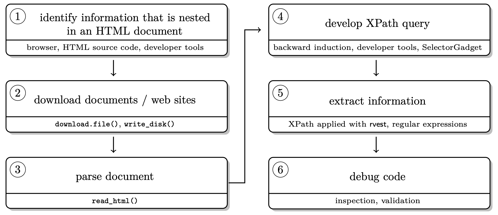
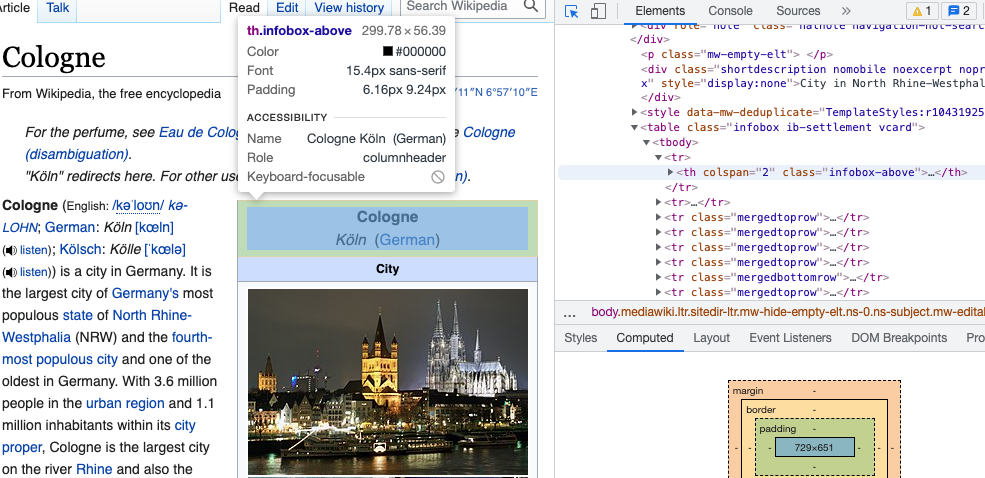
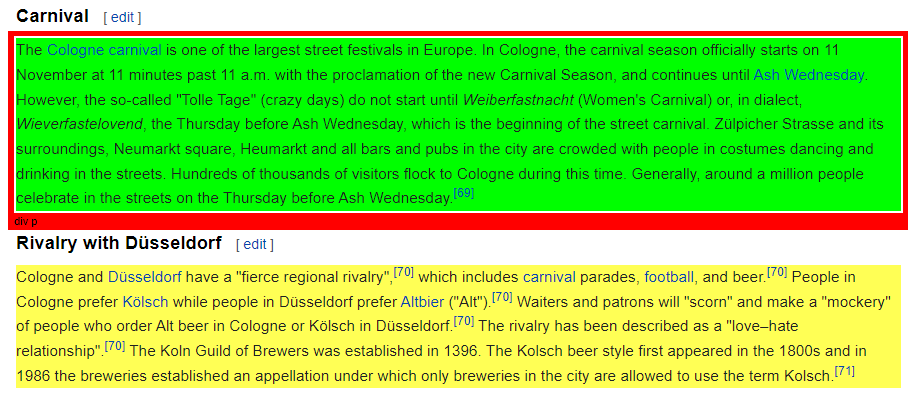
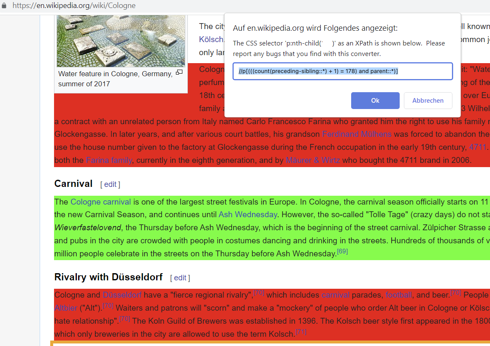
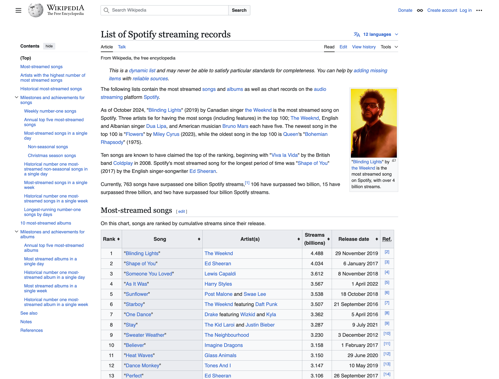
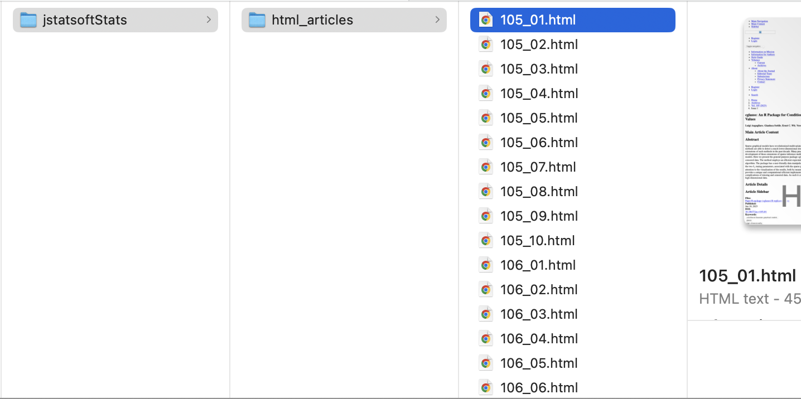

```{=html}
<style>
.h1,h2,h3 {
color:#2f1a61;
}

.subtitle, section.normal {
color:#291854;
}

.title {
color:#cc0065;
}

.nav-pills>li>a{
color: #2f1a61;
}

.nav-pills>li.active>a, .nav-pills>li.active>a:hover, .nav-pills>li.active>a:focus {
color: #fff;
background-color: #2f1a61;
}

.nav-tabs>li>a{
color: #2f1a61;
}

.nav-tabs>li.active>a, .nav-tabs>li.active>a:hover, .nav-tabs>li.active>a:focus {
color: #fff;
background-color: #2f1a61;
}

.pad-box{
padding: 1em;"
}
</style>
```


```{r setup, include=FALSE}
knitr::opts_chunk$set(echo = TRUE, message = FALSE, warning = FALSE)
```

***

After talking quite a bit about web data in the last session, today's session is dedicated to data collection - from the web!

What we will cover:

* scraping static webpages
* scraping multiple static webpages 
* API calls
* building up and maintaining you own original sets of web-based data

What we will not cover (today): 

* scraping dynamic webpages

---

# Why webscrape with R? `r emo::ji("globe")`

Web scraping broadly includes:

+ getting (unstructured) data from the web, and 
+ bringing it into shape (e.g. cleaning it, getting it into tabular format).

Why web scrape? While some influential people consider "Data Scientist" `r emo::ji("woman_technologist")` to be the [sexiest job](https://hbr.org/2012/10/data-scientist-the-sexiest-job-of-the-21st-century) of the 21st century (congratulations!), one of the sexiest just emerging academic disciplines is Computational Social Science (CSS). Why is that so? 

* data abundance online 
* social interaction online
* services track social behavior

Online data are a very promising vehicle to gather insights for you as **data scientist for the common good**.

**BUT online data are usually meant for display, not a (clean) download!**

Luckily, with `R` we can automate the whole pipeline of downloading, parsing, and post-processing to make our projects easily reproducible.

---

In general, remember, the basic **workflow for scraping static webpages** is the following.

```{r, fig.align='center', echo=F, out.width = "90%"}

```

---

# Scraping static sites with `rvest` `r emo::ji("tractor")`

Who doesn't love Wikipedia? Let's use this as our first, straight forward test case.

:::{.alert-info .pad-box}

📝 **To keep in mind**

For illustrative purposes, in this tutorial we will parse the page source directly from the live webpage. You should know that the best practice to ensure **reproducibility** would be to download the HTML file locally. In that way, you can avoid issues arising from changes in the content or structure of the source.

:::

---

**Step 1.** Load the packages `rvest` and `stringr`.

```{r, message=F}
library(rvest)
library(stringr)
library(tidyverse)
library(here)
```

**Step 2.** Parse the page source. If encoding is necessary, you can add it in the reading html step.

```{r}
parsed_url <- rvest::read_html("https://en.wikipedia.org/wiki/Cologne", 
                               encoding = "UTF-8")
```

**Step 3.** Extract information.

```{r}
parsed_url |> 
  rvest::html_element(xpath = '//p[(((count(preceding-sibling::*) + 1) = 178) and parent::*)]') |> 
  rvest::html_text()

parsed_url |> 
  rvest::html_element(xpath = '//p[76]') |> 
  rvest::html_text()


```

Another way of writing this in a more intuitive way:

```{r}
# this one is more intuitive
parsed_url |> 
  rvest::html_element(xpath = '//div[contains(@class, "mw-heading mw-heading3")]//h3[@id="Carnival"]/following::p') |> 
  rvest::html_text()

#this one is not specific enough
parsed_url |> 
  rvest::html_element(xpath = '//div[contains(@class, "mw-heading mw-heading3")]//*//following::p') |> 
  rvest::html_text()

# copy xpath
# right click on element and copy full XPath
#"/html/body/div[2]/div/div[3]/main/div[3]/div[3]/div[1]/p[76]"

parsed_url |> 
  rvest::html_element(xpath = "/html/body/div[2]/div/div[3]/main/div[3]/div[3]/div[1]/p[76]") |> 
  rvest::html_text()
```

This is because the html structure has the desired paragraph which is preceded by an [element div that contains the "mw-heading mw-heading3" class and is then followed by a header with "Carnival# as id]. Everything that is in square brakets is what comes before the p element we want as an output.


```html
<!DOCTYPE html> 
  <html> 
    <head>
      ...
  <body>
      ...
      <div class="mw-heading mw-heading3">
          <h3 id="Carnival">
            Carnival
          </h3>
          ...
      </div>
      <p>
        "The"
        <a href="/wiki/Cologne_carnival">Cologne carnival</a>
        " is one of the largest street festivals in Europe. In Cologne, the carnival season officially starts on 11 November at 11 minutes past 11&nbsp;a.m. with the proclamation of the new Carnival Season, and continues until "
        <a href="/wiki/Ash_Wednesday" title="Ash Wednesday">Ash Wednesday</a>
        ". However, the so-called "Tolle Tage" (crazy days) do not start until "
        <i>Weiberfastnacht</i>
        " (Women's Carnival) or, in dialect, "
        <i>Wieverfastelovend</i>
        ", the Thursday before Ash Wednesday, which is the beginning of the street carnival. Zülpicher Strasse and its surrounding, Neumarkt square, Heumarkt and all bars and pubs in the city are crowded with people in costumes dancing and drinking in the streets. Hundreds of thousands of visitors flock to Cologne during this time. Generally, around a million people celebrate in the streets on the Thursday before Ash Wednesday."
        <sup id="cite_ref-73" class="reference">...</sup>
      </p>
      ...
  </body>
</html>
```

You can see that even though there are other elements between the <p>...</p>, it is taking everything that is betweem these two tagnames.

---

## How can we draft our queries? 🤔

In here we present two ways:

+ **Manually inspecting the source code**
+ **Using selector tools (e.g., Selector Gadget)**

---

**Option 1.** On your page of interest, go to a table that you'd like to scrape. Our favorite browser for web scraping is Google Chrome, but others work as well. On Chrome, you go in `View > Developer > inspect elements` or right click on the element you are interested and go to `Inspect`. 

If you hover over the  code on the right, you should see boxes of different colors framing different elements of the page. Once the part of the page you would like to scrape is selected, right click on the HTML code and `Copy > Copy XPath`. That's it.

Let's try it with the [Cologne Wikipedia page](https://en.wikipedia.org/wiki/Cologne#Carnival)

```{r, fig.align='center', echo=F, out.width = "90%"}

```

---

**Option 2.** Something we did not show you, but that you might look at in your own time is the Chrome Extension `SelectorGadget`. You download the [Chrome Extension](https://chrome.google.com/webstore/detail/selectorgadget/mhjhnkcfbdhnjickkkdbjoemdmbfginb?hl=de) `SelectorGadget` and activate it while browsing the page you'd like to scrape from. You will see a selection box moving with your cursor. You select an element by clicking on it. It turns green - and so does all other content that would be selected with the current XPath.

```{r, fig.align='center', echo=F, out.width = "90%"}

```

You can now de-select everything that is irrelevant to you by clicking it again (it then turns red). Final step, then just click the XPath button at the bottom of the browser window. Make sure to use single quotation marks with this XPath!

```{r, fig.align='center', echo=F, out.width = "90%"}

```

---

Let's repeat step 2 and 3 with another example using [New York Public Library's best book recommendations for 2021](https://www.nypl.org/books-more/recommendations/best-books/adults?year=2021). `r emo::ji("cap")`


```{r, fig.align='center', echo=F, out.width = "85%"}
knitr::include_graphics("pics/nylibrary.png")
```

**Step 2.** Parse the page source.
```{r}
nypl_url <- "https://www.nypl.org/books-more/recommendations/best-books/adults?year=2021"
nypl100 <- rvest::read_html(nypl_url)
```

**Step 3.** Extract information. When going through different levels of HTML, you can also use `tidyverse` logic.

```{r eval=FALSE}
body_nodes <- nypl100 |> 
 rvest::html_elements("body") |> 
 rvest::html_children()

body_nodes |> 
 rvest::html_children()
```

play with that yourself if you like...

---

Now let's have a look at the different ways to extract information:

```{r}
# XPath
title <- nypl100 |> 
  rvest::html_elements(xpath = '//ul/li/div/div/h4') |> 
  rvest::html_text2()

# CSS
author <- nypl100 |> 
  rvest::html_elements(css = '.spbb-card__byline--grid') |> 
  rvest::html_text2()

# Combination of XPath with CSS
summary <- nypl100 |> 
  rvest::html_elements(xpath = '//*[contains(concat( " ", @class, " " ), concat( " ", "spbb-card__description--grid", " " ))]') |> 
  rvest::html_text2()

# Another way of doing it
summary <- nypl100 |> 
  rvest::html_elements(xpath = '//*[contains(@class,"spbb-card__description--grid")]') |> 
  rvest::html_text()

# this one does not work
# summary <- nypl100 |> 
#   rvest::html_elements(xpath = '.spbb-card__description spbb-card__description--grid') |> 
#   rvest::html_text2()


```

**Step 4.** Usually step 4 involves cleaning extracted data. In this case, it actually is pretty clean already, thanks to `html_text2()`. However, in many cases, we need to clean the data we scraped with regular expressions.

**Step 5.** Put everything into a data frame. `r emo::ji("book")`
```{r}
knitr::kable(data.frame(title, author, summary) |> head(3))
```

---

## Scraping HTML tables `r emo::ji("rocket")`

Oftentimes, we would like to scrape tabular data from the web. This is even easier in `rvest`!

```{r, fig.align='center', echo=F, out.width = "85%"}

```

Let's take a look at the [List of Spotify streaming records](https://en.wikipedia.org/w/index.php?title=List_of_members_of_the_European_Council) Wikipedia entry.


```{r}
# load html
url_p <- rvest::read_html("https://en.wikipedia.org/w/index.php?title=List_of_Spotify_streaming_records&oldid=1249839087")

# extract table
spotify_table_raw <- rvest::html_table(url_p, header = T) |> # extracts all <table> elements from page
  purrr::pluck(1) |> # get tablein nth place (1)
  janitor::clean_names() # clean the table names

spotify_table_raw # this is what we would get


# clean up table a bit (for further analyses?)
spotify_table <- spotify_table_raw |>
  dplyr::mutate(song = stringr::str_remove_all(song, '\"'), #remove quotation marks from song titles
                streams_billions = as.numeric(streams_billions) #make stream_billions a numeric variable
                ) |> 
  dplyr::slice(1:100) |> # drop dangling row with "As of date"
  dplyr::select(-ref) 

head(spotify_table)
```


:::{.alert-info .pad-box}

🏋 **Let's do an exercise**

Can you tell us:

a) What does it take to be within the top-100 most streamed songs on Spotify? (i.e., how many streams?)
b) Which artists have the highest number of most streamed songs? (Note that the `artist_s` string might contain multiple unique artists)

*Bonus at home 🏠*

c) Which artists have the most cumulative streams?
:::


---

# Scraping multiple pages `r emo::ji("robot")`

Whenever you want to really understand what's going on within the functions of a new R package, it is very likely that there is a relevant article published in the [Journal of Statistical Software](https://www.jstatsoft.org/index). Let's say you are interested in how the journal was doing over the past years [2023-2024].

**Step 1.** Inspect the source. Basically, follow steps to extract the XPath information.
```{r, eval=F}
browseURL("http://www.jstatsoft.org/issue/archive")
```

**Step 2** Develop a scraping strategy. We need a set of URLs leading to all sources. Inspect the URLs of different sources and find the pattern. Then, construct the list of URLs from scratch.

```{r}
## URL list build

# base
baseurl <- "http://www.jstatsoft.org/article/view/v"

# volume number
volurl <- as.character(105:110) # volumes 105 to 110

# issue number
issueurl <- c(paste0("0", 1:9), 10:12) # 01 to 12 maximum number of issues in a volume
# (there is totally a more efficient way of dealing with the inconsistency, but
# let's try to keep this simple

combinations <- tidyr::expand_grid(volurl, issueurl)
#tidyr::expand_grid produces all combinations of volurl and issueurl

urls_list <- combinations |> 
  dplyr::mutate(url = paste0(baseurl, volurl, 'i', issueurl)) |>
  dplyr::pull(url)

names_for_files <- combinations |>
  dplyr::mutate(name = paste0(volurl, '_', issueurl, '.html')) |>
  dplyr::pull(name)

```

**Step 3** Think about where you want your scraped material to be stored and create a directory.

```{r, eval=F}
here()
tempwd <- here::here("session-06-web-scraping/data/jstatsoftStats")
#here from here package creates a character string that represents a path to a directory

dir.create(tempwd, recursive = TRUE)
#recursive = TRUE indicates that it should create all directories along the specified path if they don't exist

setwd(tempwd)
```

**Step 4** Download the pages. Note that we did not do this step last time, when we were only scraping one page.

```{r, eval=F}
folder <- paste0(tempwd, "/html_articles/")
#concatenate the tempwd path with "/html_articles/" to create another path

dir.create(folder, recursive = TRUE)

for (i in seq_along(urls_list)) {
  # only update, don't replace
  if (!file.exists(paste0(folder, names_for_files[i]))) {
    # skip article when we run into an error
    tryCatch(
      download.file(urls_list[i], destfile = paste0(folder, names_for_files[i])),
      error = function(e)
        e #the error object (denoted by e) is returned but not acted upon, meaning the error is essentially ignored
    )
    # don't kill their server --> be polite!
    Sys.sleep(runif(1, 0, 1)) #one random sleep interval of 0-1 seconds
  } 
}


```

While R is downloading the pages for you, you can watch it directly in the directory you defined...

```{r, fig.align='center', echo=F, out.width = "70%"}

```

Check whether it worked.
```{r, eval=F}
list_files <- list.files(folder, pattern = "0.*") #list of file names that match the regex
list_files_path <- list.files(folder, pattern = "0.*", full.names = TRUE) #full file paths including directory paths of matched files

length(list_files)
```

Yay! Apparently, we scraped the HTML pages of 60 articles. 

---

## (Git)ignoring files `r emo::ji("no_good_woman")`

In case you scraping project is linked to GitHub (as it will be in your assignment!), it can be useful to **.gitignore** the folder of downloaded files. This means that the folder can be stored in your local directory of the project but will not be synced with the remote (main) repository. Here is information on how to do this using [RStudio](https://carpentries-incubator.github.io/git-Rstudio-course/02-ignore/index.html).

In Github Desktop it is very simple, you do your scraping work, the folder is created in your local repository and before your commit and push these changes, you go on `Repository` > `Repository Settings` > `Ignored Files` and edit the .gitignore file (add the name of the new folder / files you don't want to sync). More generally, it makes sense to exclude .Rproj files, .RData files (and other binary or large data files), draft folders and sensitive information from version control. Remember, git is built to track changes in code, not in large data files.

Or you can access the .gitignore file in your file explorer `command + shift + .` in macOS.

---

**Step 5** Import files and parse out information. A loop is helpful here!
```{r, eval=F}
# define output first
authors <- character()
title <- character()
datePublish <- character()

# session goes here

# then run the loop
for (i in seq_along(list_files_path)) {
  
  html_out <- rvest::read_html(list_files_path[i])
    
  authors[i] <- html_out |> 
    rvest::html_elements(xpath = '//*[contains(concat( " ", @class, " " ), concat( " ", "authors_long", " " ))]//strong') |> 
    rvest::html_text2()
    
    
  title[i] <- html_out |> 
    rvest::html_elements(xpath = '//*[contains(concat( " ", @class, " " ), concat( " ", "page-header", " " ))]') |> 
    rvest::html_text2()
    
  datePublish[i] <- html_out |> 
    rvest::html_elements(xpath = '//*[contains(concat( " ", @class, " " ), concat( " ", "article-meta", " " ))]//*[contains(concat( " ", @class, " " ), concat( " ", "row", " " )) and (((count(preceding-sibling::*) + 1) = 2) and parent::*)]//*[contains(concat( " ", @class, " " ), concat( " ", "col-sm-8", " " ))]') |> 
    rvest::html_text2()
  
}

# inspect data
authors[1:3] 
title[1:3]
datePublish[1:3]

# create a data frame
dat <- data.frame(authors = authors, title = title, datePublish = datePublish)
head(dat)
```

---

**Step 6** Clean data...

You see, scraping data from multiple pages is no problem in R. Most of the brain work often goes into developing a scraping strategy and tidying the data, not into the actual downloading/scraping part.

Scraping is also possible in much more complex scenarios! Watch out for workshop presentations on 

* Text analytics with `quanteda`
* Regular expressions with `stringr`
* Data cleaning with `janitor`

and many more `r emo::ji("star_struck")`

---

# Good scraping practice

There is a set of general rules to the game: 

1. You take all the **responsibility** for your web scraping work.
2. Think about the nature of the data. Does it entail **sensitive information**? Do not collect personal data without explicit permission.
3. Take all **copyrights** of a country’s jurisdiction into account. If you publish data, do not commit copyright fraud.
4. If possible, **stay identifiable**. Stay polite. Stay friendly. Obey the scraping etiquette.
5. If in doubt, **ask the author/creator/provider** of data for permission—if your interest is entirely scientific, chances aren’t bad that you get data.

---

## How do I know the scraping etiquette of a site? `r emo::ji("handshake")`

Robot exclusion standards (`robot.txt`) are informal protocols to prohibit web robots from crawling content. They list documents that are allowed to crawl and which not. It is not a technical barrier but an ask for compliance.

They are located in the root directory of a website (e.g `https://de.wikipedia.org/robots.txt`). 

For example, let's have a look at Wikipedia's [robot.txt](https://de.wikipedia.org/robots.txt) file, which is very human readable.

General rules are listed under `User-agent: *` which is most interesting for R-based crawlers. A universal ban for a directory looks like this `Disallows: /`, sometimes Crawl-delays are suggested (in seconds) `Crawl-delay: 2`.

---

## What is "polite" scraping? `r emo::ji("snail")`

First thing would be not to scrape at a speed that causes trouble for their server. Therefore, whenever you loop over a list of URLs, add a pause to the system at the end of the loop (e.g., `Sys.sleep(runif(1, 1, 2))` a random number between 1 and 2, and then the `Sys.sleep()` function causes the R script to pause for that random number of seconds).

And generally, it is better practice to store data on your local drive first (`download.file()`), then parse (`rvest::read_html()`). 

:::{.alert-primary .pad-box}

**🌳 A footnote on this practice.** 

In the digital context, we often forget that or actions do have physical consequences. For example, training AI, using blockchain, and streaming videos all create considerable amounts of $CO^2$ emissions. So does bombarding a server with requests - certainly to a much lesser extent than the previous examples - but please consider whether you have to re-run a large scraping project 100 times in order to debug things. 

Furthermore, downloading massive amounts of data may arouse attention from server administrators. Assuming that you've got nothing to hide, you should stay identifiable beyond your IP address.
:::

---

## How can I stay identifiable? `r emo::ji("bust_in_silhouette")`

**Option 1**: Get in touch with website administrators / data owners.

**Option 2**: Use HTTP header fields `From` and `User-Agent` to provide information about yourself.

```r
url <- "http://a-totally-random-website.com"

#rvest's session() creates a session object that responds to HTTP and HTML methods.
rvest_session <- rvest::session(url, 
                                httr::add_headers(
                                  `From` = "my@email.com", 
                                  `UserAgent` = R.Version()$version.string
                                  )
                                )
                
scraped_text <- rvest_session |> 
            rvest::html_elements(xpath = "p//a") |> 
            rvest::html_text()
```

rvest's `session()` creates a session object that responds to HTTP and HTML methods.
Here, we provide our email address and the current R version as User-Agent information.
This will pop up in the server logs: The webpage administrator has the chance to easily get in touch with you.

---

# On an API far, far away... `r emo::ji("star")`

```{r}
library(httr)
library(jsonlite)
library(xml2)
library(glue)
```

To get data from an API, we suggest to follow a workflow like this:

1. Read the APIs documentation!
2. Get the baseurl
3. Find out the parameters referring to the resources of interest to you
4. Create a query url from the base url and the query parameters
5. Run the `GET` function on the query url
6. Depending on the encoding (usually, it's json), you will need to:
  + Parse the result with the `content` function
  + Either use `jsonlite` or `xml2` to parse the json or xml files

---

Let's have a look at an example, the [Star Wars API](https://swapi.dev/):

```{r echo = F, eval = F}
browseURL("https://swapi.dev/")
```

```{r}
baseurl <- "https://swapi.dev/api/"

query <- 'films'

httr::GET(paste0(baseurl, query)) |> # Make API call
  httr::content(as = 'text') |> # extract content as text
  jsonlite::fromJSON() |> # convert JSON data into R object (nested list)
  purrr::pluck(4) # extract from index inside nested list (4th place corresponding to "results" in the payload)
  
```

```{r}
query <- 'people/?search=skywalker'

httr::GET(paste0(baseurl, query)) |> # Make API call
  httr::content(as = 'text') |> # extract content as text
  jsonlite::fromJSON() |>  #convert JSON data into R object (nested list)
  purrr::pluck(4)  # extract from index inside nested list (4th place corresponding to "results" in the payload)
 
```

If you do not know the source format, the `http_type` function will help you out!

```{r}
query <- 'starships/?search=death/?format=wookiee'

httr::GET(paste0(baseurl, query)) |>
  httr::http_type()
```

---

## API keys and authentication `r emo::ji('lock')``

For many APIs, you will need to obtain an api key to retrieve data. Once you received your api key (or token), you will also need to adapt your GET query. How you need to do this depends a lot on the API. Let's take a look at how to do this with the API for the [US congress](https://api.congress.gov/). The API is actually valid across a number of [US government institutions](https://api.data.gov/). 

We can sign up for an API key [here](https://api.data.gov/signup/). The API website, gives us detailed information on how to build our queries. But how do we actually authenticate ourselves with the API key? The [documentation](https://api.data.gov/docs/api-key/) tells us that there are multiple ways to go about this. We can either do adapt the use HTTP basic authentication, the GET query parameter, or the HTTP header.

Here's a quick overview of how to implement these with `httr`:

```r
# sign up for API key: https://api.data.gov/signup/
#Sys.setenv(MY_API_KEY = "[YOUR API KEY GOES HERE]") # store your personal API key in R environment

# US Congress: Bills
baseurl <- "https://api.congress.gov/v3/" # base url (remains consistent across queries)
api_key <- glue::glue("api_key={Sys.getenv('MY_API_KEY')}") # your personal API key
query <- "bill" # query

try2 <- GET(glue::glue(baseurl, query, "?", api_key)) |> 
  content(as = "text") |> 
  fromJSON() |> 
  pluck(1) |> 
  as.data.frame()
```


```r
# US Congress: Actions on a specific nomination
query <- "nomination/115/2259/actions"

GET(glue::glue(baseurl, query, "?", api_key)) |> 
  content(as = "text") |> 
  fromJSON() |> 
  pluck(1) |> 
  as.data.frame()
```

```r
# US Congress: Summaries filtered by congress and bill type
query <- "summaries/117/hr?fromDateTime=2022-04-01T00:00:00Z&toDateTime=2022-04-03T00:00:00Z&sort=updateDate+desc"

GET(glue::glue("{baseurl}{query}&{api_key}")) |> # another way of using glue()
  content(as = 'text') |>
  fromJSON() |>
  pluck(3) |>
  as.data.frame()
```

```r
# US Congress: Legislation sponsored by a specific congress member
query <- "member/L000174/sponsored-legislation.xml" # data can be formatted as xml too

GET(glue::glue(baseurl, query, "?", api_key),
    add_headers("X-Api-Key" = Sys.getenv("MY_API_KEY"))) |>
  content(as = "text") |>
  read_xml() |>
  xml_find_all("//sponsoredLegislation//title") |> 
  xml_text()
```

Retrieving data from API's using `httr` can at times be quite tiresome. Luckily, there are many R libraries that make it much easier to retrieve data from APIs. Here is a [list of ready-made R bindings to web-APIs](https://ropensci.org/packages/data-access/). Actually, even the starwars API we queried earlier has its own R package, `rwars`!

---

# <b style="color:#2f1a61">Acknowledgements</b> {.unnumbered}

This tutorial drew heavily on Simon Munzert's book [Automated Data Collection with R](http://r-datacollection.com/) and related [course materials](https://github.com/simonmunzert/web-scraping-with-r-extended-edition). We also used an [example](https://keith-mcnulty.medium.com/how-to-scrape-the-web-in-r-d77b11fca40d) from Keith McNulty's blog post on tidy web scraping in R. For the regex part, we used examples from the string manipulation section in Hadley Wickham's [R for Data Science](https://r4ds.hadley.nz/strings) book.

This script was drafted by [Tom Arendt](https://github.com/tom-arend) and [Lisa Oswald](https://lfoswald.github.io/), with contributions by [Steve Kerr](https://smkerr.github.io/), [Hiba Ahmad](https://github.com/hiba-ahmad), [Carmen Garro](https://github.com/cgarroca), and [Sebastian Ramirez-Ruiz](https://seramirezruiz.github.io/).


