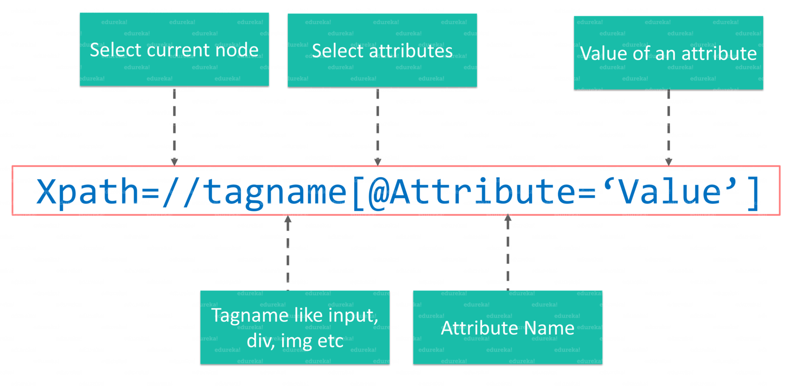
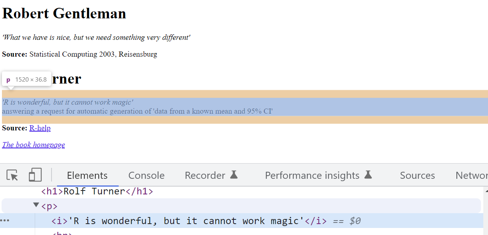
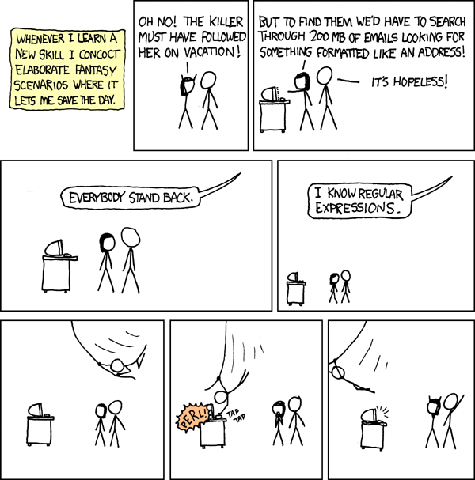

```{r setup, include=FALSE}
knitr::opts_chunk$set(echo = TRUE, message = FALSE, warning = FALSE)
```
***

After our last session where we learned how to connect R to a database and query it, today's session will focus on webdata and regular expressions. First, we will use R to inspect and locate elements in html and xml structures using xpath. Then, we will quickly look at `stringr` and wrap up with regular expressions.

Both xpath and regular expressions are extremely useful when it comes to webdata. Locating data in nested html structures is particularly useful when it comes to scraping, our next session. 

Regular expressions are handy whenever manipulating strings and will serve you well in many situations. In the context of webdata, they can be particularly useful when handling the type of uncleaned data we get after we scraped the internet and need to extract specific information or just tidy up our results.

# HTML structure `r emo::ji('deciduous_tree')`

Here is an example of a document object model (DOM). Notice how the there is a cascading structure of html nodes. 

```{html, prompt = FALSE, eval = FALSE}
<!DOCTYPE html> 
  <html> 
    <head>
      <title id=1>First HTML</title>
    </head>
  <body>
      <div>
          <h1>
            I am your first HTML file!
          </h1>
      </div>
  </body>
</html>
```

A simple xpath in this example would be `html/body/div/h1`. The simple slashes in this example indicate an **absolute path**. This means, we start at the root node and follow the whole way down to our target element h1.

**Relative paths** on the other hand are indicated with double slashes `//`. Relative paths skip nodes and do not need to start at the root node. An example here would be `//body//h1`.

The wildcard operator `*` allows us to skip elements in the xpath.

Now let's have a look at how to do this in R:

```{r, message=F}
library(rvest)
library(stringr)
```

Before we can go ahead and locate elements on a webpage with xpaths, we need to parse our webpage. Parsing a website in R is straightforward:

```{r}
parsed_doc <- read_html("http://www.r-datacollection.com/materials/ch-4-xpath/fortunes/fortunes.html") 
```

Now that we have the parsed document, we can locate individual elements with the xpath. For this we use `rvest`, a library that you will learn more about in the next session. The `html_elements()` function finds and selects elements in the parsed document. We can use both css and xpath selectors.

```{r}
html_elements(parsed_doc, xpath = "/html/body/div/p/i")
```

# Xpath Basics `r emo::ji('woman_technologist')`

Now let's take a look at some more complex examples of xpaths. Elements ob the webpage can also be selected with xpath by leveraging their relations to the elements that they are connected to. The basic syntax for this is `element1/relation::element2`. 

If we would like to extract the two names on our example webpage, using element relations, we can do so like this:

```{r}
html_elements(parsed_doc, xpath = "//p/preceding-sibling::h1")
```
Finally, we can also use True/False conditions on our elements to filter them. In xpath, this is called **predicates**. A **numeric predicate** lets us select the nth element within a given path. Let us use this to extract the Source of the quotes on our example page:

```{r}
html_elements(parsed_doc, xpath = "//p[2]")
```
Next to numeric predicates, there are also **textual predicates**. Textual predicates allow us to do rudimentary text matching. This is implemented in string functions like `contains()`, `starts_with` or `ends_with()`. Predicates can also be chained together with `and`. Multiple xpaths can be combined in an or logic with the pipe operator `|`:

```{r}
html_elements(parsed_doc, xpath = "//h1[contains(., 'Rolf')] | //h1[contains(., 'Robert')]" )
```

```{r, fig.align='center', echo=F, out.width = "90%"}

```


While we can use R to inspect the parsed document, it is much easier to do this part in the browser. To do so, we right click anywhere on the website and click on "Inspect" or. On windows, you can also simply press F12. 

```{r, fig.align='center', echo=F, out.width = "90%"}

```

This opens up the developer tools interface on your browser. The most important tab in the developer tools is the "Elements" tab. This tab shows you the source code of the webpage in an interactive manner. Now, when we hover over the elements in the tab they will be highlighted on the webpage. By clicking the mouse icon on the top left, we can reverse this behaviour.

# String manipulation with `stringr` `r emo::ji('speech_balloon')`

`stringr` and `stringi` are the two most common libraries for string manipulation in R. Before we look into regular expressions, let us quickly look into some of th core functionalities of `stringr` and how you can use them.   

Here is a quick overview of the most useful functions in the `stringr` package:
```{r}
x <- c("apple", "banana", "pear")

str_detect(x, "e")
```
To extract the actual text of a match, use `str_extract()`. Note that `str_extract()` only extracts the first match. To get all matches, use `str_extract_all()`, which returns a list.

```{r}
str_extract_all(x, 'a')
```

`str_replace()` and `str_replace_all()` allow you to replace matches with new strings. The simplest way is to replace a fixed string, however with `str_replace_all()` you can perform multiple replacements by supplying a named vector:

```{r}
str_replace_all(x, c("a" = "A", "b" = "B", "p" = "P"))
```

`str_locate()` and `str_locate_all()` give you the starting and ending positions of each match. These are particularly useful when none of the other functions does exactly what you want. 

```{r}
str_locate(x, 'a')
```

# Regular expressions `r emo::ji('memo')`

```{r, fig.align='center', echo=F, out.width = "90%"}

```

Regular expressions (Regex) allow us to manipulate strings based on pattern matching. Regex patterns specify a sequence of strings, either explicitly or by meta characters. While they can be a hard nut to crack, they are extremely useful.

Meta characters allow us to abstract from explicit patterns. These meta characters are `. \ | ( ) [ { ^ $ * + ?`. For example, `.` is called a wildcard, as it matches any character, except for line breaks (`\n`). 

```{r}
str_view(x, "a.")
```

`? * + {n} {n,} {n,m}` are so-called *quantifiers*, that allow us to match the preceding character either zero or one `?`,  zero or more `.`, or one or more `+` times. `{n}` allows us to match a pattern exactly n times. To match n times and more, we add a comma in the curly brackets `{n,}` and to match between n and m times, we use `{n,m}`.

```{r}
str_view(x, "p+")
```
We can also match for specific *character classes*: If you would like to match whitespaces (spaces, linebreaks, tabs) you can use `\\w`. To match any digit, simply use `\\d`, for word character (digits and alphabetic characters) you can use `\\w`. We can negate those character classes by using them in uppercase (e.g. `\\D` matching all non-digits).

```{r}
y <- "1. A small sentence. - 2. Another tiny sentence."
str_view_all(y, "\\s(\\w{4,5})\\s")
str_view_all(y, "\\d\\W")
```
R's regex implmentation also ships with a number of predefined character classes, like `[:upper:]`, `[:lower:]` and `[:punct:]`.
They are usually simpler and much easier to remember than corresponding regex patterns. Note however, that these will require double squared brackets in many of the base R functions.

Next to character classes and quantifiers, *anchors* match the start `^` or end `$` of a string. *Alternates* allow us to handle multiple cases in our pattern. As in R `|`, is equivalent to an or. With `[qwert]` we are creating a "one of" pattern that matches any of the strings in the squared brackets. To negate this and get "anything but" we use `[^qwert]`. Parenthesis in regex are used to create groups and establish an order of evaluation. 

```{r}
str_view(x, "^a|b")
```
```{r}
fruits <- c("apple", "orange", "pear")
fruit_match <- str_c(fruits, collapse = "|")
str_subset(stringr::sentences, fruit_match) %>% head(3)
```

At this point you may wonder yourself, how we match those characters that are used as meta characters in regex.T his is where it gets complicated. Theoretically, we only use `\` as an escape character. However, we also use regular characters, like `\d` for instance, to match digits or `\s` to match white spaces. Therefore, we add another backward slash to escape the meta character `\\`. To match a question mark, we would use `\\?`.

```{r}
z <- c('abc?defg', '123456?89', "[?.{!]\\")
str_view(z, '\\?')
```
Finally a word of caution at the end: Since regular expressions are extremely powerful in string manipulation, it is easy to try and solve every problem with a single regex. Do not forget that you have other tools available in a programming language and you can break down the problem by writing a series of simpler regexes. 

# Regex exercises  `r emo::ji('wrench')`

1. Can you explain what these regular expressions match?

* `"^.*$"`
* `"\\{.+\\}"`
* `"\\d{4}-\\d{2}-\\d{2}"`
* `"\\\\{4}"`


2. How many words are there in `stringr::words` that end with a "y" and are exactly 3 characers long?

```{r}
str_detect(stringr::words, '^\\w{2}y$') %>% sum
```

3. Now, try to find all words that end with "-ed" but not with "eed"!

```{r}
str_subset(stringr::words, "[^e]ed$")
```

4. Let us now write a pattern that matches both emails in the vector below. 

```{r}
hertie_emails <- c('456123@students.hertie-school.org', 'h.simpson@students.hertie-school.org')
str_view(hertie_emails, '(^\\d{6}|^\\w\\.\\w{1,})@students\\.hertie-school\\.org')
```

5. Now try to extract all names and corresponding phone numbers from the string below.

```{r}
raw_data <- "555-1239Moe Szyslak(636) 555-0113Burns, C. Montgomery555-6542Rev. Timothy Lovejoy555 8904Ned Flanders636-555-3226Simpson, Homer5553642Dr. Julius Hibbert"

str_view_all(raw_data, "[[:alpha:]., ]{2,}")

str_view_all(raw_data, "\\(?(\\d{3})?\\)?(-| )?\\d{3}(-| )?\\d{4}")

```

# Sources

This tutorial drew heavily on Simon Munzert's book [Automated Data Collection with R](http://r-datacollection.com/) and related [course materials](https://github.com/simonmunzert/web-scraping-with-r-extended-edition). 
For the regex part, we used examples from the string manipulation section in Hadley Wickham' s [R for Data Science](https://r4ds.had.co.nz/strings.html) book.

